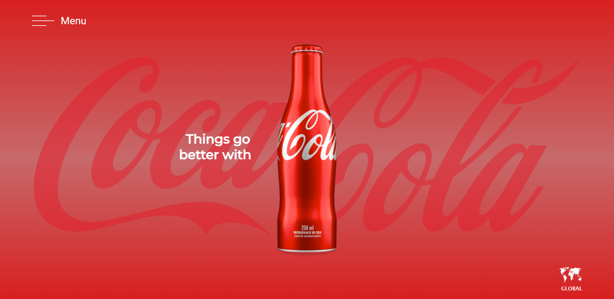

Coca-Cola Figma - DS2M 
 Site criado com objetivo didático para as aulas de PWFE do curso Desenvolvimento de Sistemas do SENAI Jandira, sobre orientação do professor Fernando Leonid.

O projeto consiste em recriar o layout que foi dado pelo professor.

O código foi construido pensando em boas práticas, como responsabilidade única e funções puras.

